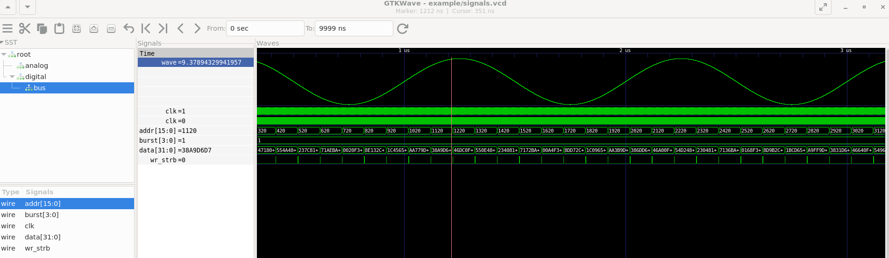

# VCD Tracer for C++

## About

[VCD](https://en.wikipedia.org/wiki/Value_change_dump) is a simple
trace log format for logic simulation tools such as Verilog and VHDL simulators. It's output is designed
to be viewed in a [waveform
viewer](https://en.wikipedia.org/wiki/Waveform_viewer) such as
[GTKWave](http://gtkwave.sourceforge.net/) and many commercial
simulation tools. It is not an efficient format, but it is easy to
implement and use.

This library creates VCD files from C++ software. It is designed to be
embedded in software that has some sort of signal hierarchy and time
domain processing. For example it can be embedded in an instruction
set simulator.

## LICENSE

Copyright (c) 2022, Philip Mulholland

BSD 3-Clause License. See LICENSE.

## Usage

Signals are traced using the templated `vcd_tracer::value<>`
class. The data type that can be traced is limited to fundamental
types. The bit size can be specified independently to the 

~~~
   vcd_tracer::value<bool> clock1;
   vcd_tracer::value<double> sine_wave;
   vcd_tracer::value<uint16_t> addr;
   vcd_tracer::value<uint32_t> data;
   vcd_tracer::value<uint8_t, 4> burst;
   vcd_tracer::value<bool> wr_rd_n;
~~~

A module hierarchy is defined independently of the trace
values. Modules can be defined to group values. Values are
"elaborated" within a given module. Without elaboration a value cannot
be traced.

~~~
   vcd_tracer::top dumper("root");

   vcd_tracer::module digital(dumper.root, "digital");
   vcd_tracer::module bus(digital, "bus");
   vcd_tracer::module analog(dumper.root, "analog");
   
   // The elaboration of signals inside of the module hierarchy
   digital.elaborate(clock1, "clk");
   analog.elaborate(sine_wave, "wave");
   bus.elaborate(addr, "addr");
   bus.elaborate(data, "data");
   bus.elaborate(burst, "burst");
   bus.elaborate(wr_rd_n, "wr_strb");
~~~

Traces are output to a `std::ostream`. Once all values have been
elaborated the header can be finalized.

~~~
   std::ofstream fout(fout_name);
   dumper.finalize_header(fout, 
       std::chrono::system_clock::from_time_t(0));
~~~

A trace value is updated with the `set()` method.

~~~
   burst.set(1);
   clock1.set(i & 0x1);
   sine_wave.set(WAVE_BIAS_V + (WAVE_AMPL_V * sin(seconds * WAVE_FREQ_HZ * 2.0 * M_PI)));
   wr_rd_n.set(true);
   addr.set(static_cast<uint16_t>(mem_addr&0xFFFF));
   data.set(memory[mem_addr]);
~~~

Values are written to file when the `time_update_abs()` or
`time_update_delta()` methods are called.

~~~
   dumper.time_update_abs(fout, 
        std::chrono::nanoseconds{ TICK_NS * i });
~~~

## Example

The above code results in this VCD header:

~~~
$date
   Thu Jan  1 00:00:00 1970
$end
$timescale
   1ns
$end
$version
   C++ Simple VCD Logger
$end
$scope module root $end
$scope module digital $end
$var wire 1 ! clk $end
$scope module bus $end
$var wire 16 $ addr $end
$var wire 32 % data $end
$var wire 4 & burst $end
$var wire 1 ' wr_strb $end
$upscope $end
$upscope $end
$scope module analog $end
$var real 64 " wave $end
$upscope $end
$upscope $end
$enddefinitions $end
~~~

The trace data is:

~~~
#0
x!
r6.910777109229929e-310 "
x#
bx $
bx %
bx &
x'
0!
r5 "
0#
b0 $
b0 %
b01 &
1!
r5.028274147845015 "
#1
0!
r5.056547179475086 "
1#
#2
~~~

The output will look something like this:

## Implementation

This library is designed to use dependency injection rather than a C++
class hierarchy for defining the relation between design hierarchy and
variables. This allows the module and signal hierarchy creation to be de-coupled from tracing.

## Related Projects

Other Open Source Software using VCD:

Viewers:

- http://gtkwave.sourceforge.net/ (Opensource waveform viewer)

Tracers:

- https://github.com/accellera-official/systemc (C++ Simulation)
- https://www.veripool.org/verilator/ (Verilog Simulator)
- http://iverilog.icarus.com/-  (Verilog Simulator)
- https://github.com/westerndigitalcorporation/pyvcd (Output from Python)

VCD Descriptions:

- https://wiki.tcl-lang.org/page/VCD
- https://en.wikipedia.org/wiki/Value_change_dump

## Thanks

This repository was generated from <https://github.com/cpp-best-practices/gui_starter_template>.
